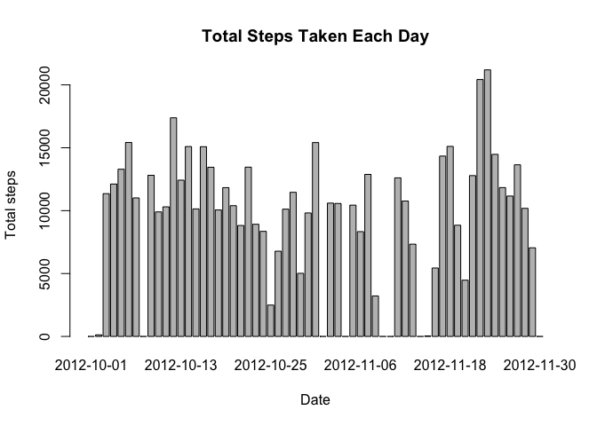
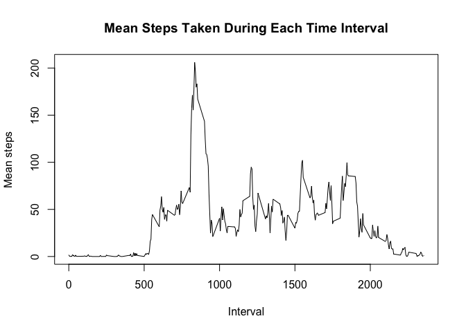
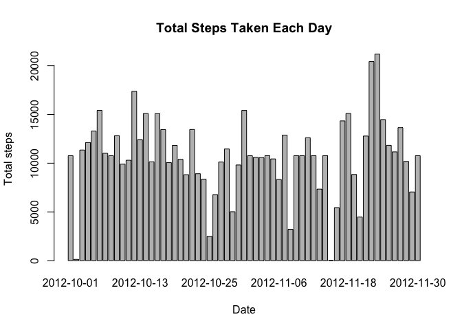
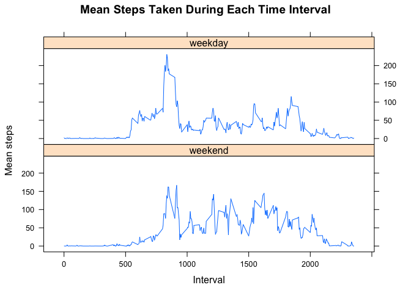

The following code loads the packages required to execute the code.


```r
library(dplyr)
```

```
## 
## Attaching package: 'dplyr'
```

```
## The following objects are masked from 'package:stats':
## 
##     filter, lag
```

```
## The following objects are masked from 'package:base':
## 
##     intersect, setdiff, setequal, union
```

```r
library(lattice)
```
The following code sets the default to save the figures in a folder.


```r
knitr::opts_chunk$set( fig.path = "figs/fig-")
```

The following code loads the activity data from the provided csv file. The activity data includes two months of activity data recorded in 5 minute intervals. The table includes the numbers of steps in the interval, the date, and the start time of the interval recorded as a integer.

The date is provided as character class, and this code converts it to date format.


```r
actdata <- read.csv("/Users/stephanie.toering/Documents/RProjects/RepData_PeerAssessment1/activity.csv")
actdata <- mutate(actdata, date = as.Date(date))
```

## What is the total number of steps taken per day?

This section of the assignment looks at the mean and median steps taken each day. The code generates a new data frame with the number of steps taken per day for the two months of the data set. The NA values are ignored.

This new data frame is then plotted (Total Steps Taken Each Day), and the mean and median number of steps taken each day is calculated. 


```r
perday <- actdata %>% 
  group_by(date) %>%
  summarize(Total_steps = sum(steps, na.rm=TRUE))
```

```
## `summarise()` ungrouping output (override with `.groups` argument)
```

```r
barplot(perday$Total_steps ~ perday$date, xlab = "Date", ylab = "Total steps", main = "Total Steps Taken Each Day")
```

<!-- -->

```r
pdmean <- mean(perday$Total_steps)
pdmedian <- as.numeric(median(perday$Total_steps))

fpdmean <- format(pdmean, digits = 5)
fpdmedian <- format(pdmedian, digits = 5)
```

The mean number of steps per day is 9354.2.
The median number of steps per day is 10395.

## What is the average daily activity pattern?

This section plots the mean number of steps taken in a given time interval across all of the days recorded and then determines the time interval with the maximum mean.


```r
perint <- actdata %>% 
  group_by(interval) %>%
  summarize(Mean_steps = mean(steps, na.rm=TRUE))
```

```
## `summarise()` ungrouping output (override with `.groups` argument)
```

```r
plot(perint$Mean_steps ~ perint$interval, type = "l", xlab = "Interval", ylab = "Mean steps", main = "Mean Steps Taken During Each Time Interval")
```

<!-- -->


```r
intmax <- perint[which.max(perint$Mean_steps),]
int <- as.numeric(intmax$interval)
```

The time interval with the maximum mean number of steps is 835.

## Imputing missing values

In this section, the missing data ("NA") in the original data set will be counted and replaced. 


```r
NAsteps <- as.numeric(sum(is.na(actdata$steps)))
```
The number of rows with missing (NA) values is 2304.

The NA values will be replaced using the mean step value for the time interval that contains the "NA". This mean value is contained in the perint dataframe created in the previous section of code.

A new dataframe actdata2 will be created in which the NA values are replaced with the interval mean from the perint dataframe. A vector is created with the mean interval values repeated to length 17568 (the length of the actdata2 data frame). This vector is used to create a new column in the actdata2 dataframe. Then, the NA values in the actdata2 steps column will be identified and replaced with the mean values from the newly created column.


```r
actdata2 <- actdata
newcol <- rep(perint$Mean_steps, length.out=17568)
actdata2 <- mutate(actdata2, Int_mean = newcol)
actdata2$steps <- ifelse(is.na(actdata2$steps), actdata2$Int_mean, actdata2$steps)
```
This new data frame is then plotted (Total Steps Taken Each Day), and the mean and median number of steps taken each day is calculated. 


```r
perday2 <- actdata2 %>% 
  group_by(date) %>%
  summarize(Total_steps = sum(steps))
```

```
## `summarise()` ungrouping output (override with `.groups` argument)
```

```r
barplot(perday2$Total_steps ~ perday2$date, xlab = "Date", ylab = "Total steps", main = "Total Steps Taken Each Day")
```

<!-- -->


```r
pdmean2 <- mean(perday2$Total_steps)
pdmedian2 <- median(perday2$Total_steps)

fpdmean2 <- format(pdmean2, digits = 5)
fpdmedian2 <- format(pdmedian2, digits = 5)

incmean <- pdmean2-pdmean
incmedian <- pdmedian2-pdmedian

fincmean <- format(incmean, digits = 5)
fincmedian <- format(incmedian, digits = 5)
```

The mean number of steps per day is 10766.
The median number of steps per day is 10766.

Replacing the NA values with the mean values for the specific time interval increased both the mean and median values as compared to the original analysis in which the NA values were ignored. The mean value increased by 1412 steps and the median value increased by 371.19 steps.

## Are there differences in activity patterns between weekdays and weekends?

In this section of the assignment, we want to look at whether there are differences in the daily activity on weekdays as compared to weekends. First, a new column (Day) is created in the actdata2 dataframe that indicates what day of the week corresponds to the given date. Then a new column (Type) is added that uses the day of the week to establish the factor labels of weekend or weekday.


```r
actdata2 <- mutate(actdata2, Day = weekdays(actdata2$date))
actdata2 <- mutate(actdata2, Type =factor(actdata2$Day,
      levels = c("Saturday","Sunday","Monday","Tuesday","Wednesday",   "Thursday","Friday"),
      labels = c("weekend", "weekend","weekday", "weekday", "weekday", "weekday", "weekday")          ))
```

Next, a data frame is created that calculates the mean number of steps per time interval based on whether the date corresponds to a weekday or a weekend.


```r
perint2 <- actdata2 %>% 
  group_by(Type, interval) %>%
  summarize(Mean_steps = mean(steps))
```

```
## `summarise()` regrouping output by 'Type' (override with `.groups` argument)
```

The following code creates a line plot of the mean number of steps per time interval split into panels by whether it is a weekday or a weekend.


```r
xyplot(perint2$Mean_steps ~ perint2$interval|perint2$Type,
       xlab = "Interval",
       ylab = "Mean steps",
       main = "Mean Steps Taken During Each Time Interval",
       layout = c(1,2),
       lty=1, type = "l")
```

<!-- -->

This graph indicates that the individual does have different activity patterns on weekdays and weekends.

